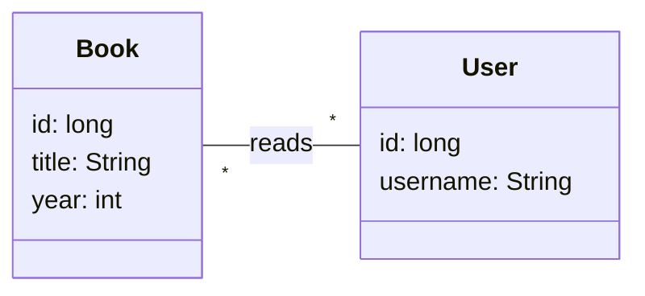

# micronaut-solutions

Model solutions for the Micronaut labs: book microservice.

## Bounded context

This microservice manages a small book database, where `Book`s are written by `Author`s and read by `User`s.

